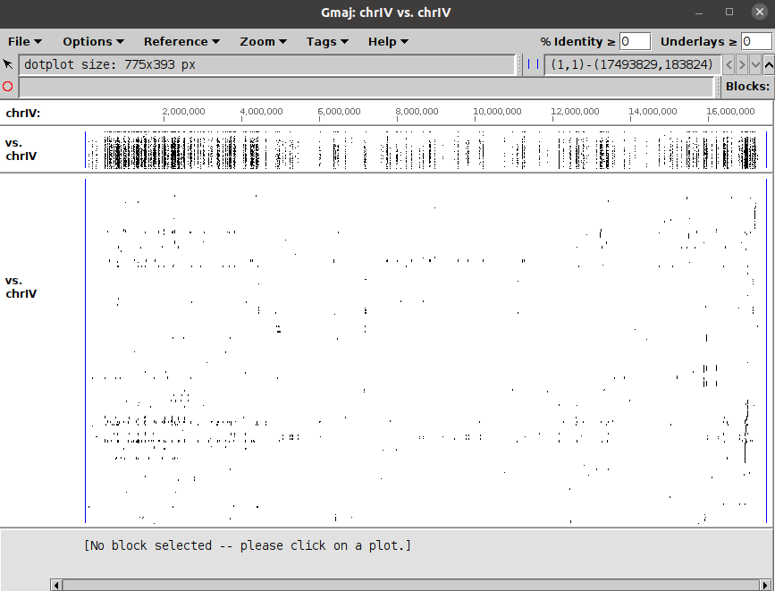

#  FastZ: Accelerating Gapped Whole GenomeAlignment on GPUs

This repo contains a proof of concept integration of FastZ with LASTZ version 1.04.06.

## Software Requirements
- [x] nvidia cuda-toolkit 11.0
- [x] cmake 3.8 or higher
- [x] gcc and g++ 5.0 or higher
- [x] python3

## Running

This code has only been tested on the plus strand using segment files that have been extracted from LASTZ.

```cd source
    make
    ./lastz ce11_chrIV.fa cb4_chrIV.fa --gapped --nogfextend --strand=plus --segments=chr4_first_two_mill_seed_subset --format=maf --output=chr4_first_two_mill_seed_subset.maf
    python3 postprocess.py -i chr4_first_two_mill_seed_subset.maf
```

## Output

FastZ currently only supports maf files. An example maf file is included named ```chr4_first_two_mill_seed_subset.maf```. 

An opensource interactive software called [Gmaj](https://globin.bx.psu.edu/dist/gmaj/) can be used to view the output files. 

A preview of the sample maf file is as below.




## Parameters
Currently there are a defines in the src file FastZ.h which control various aspects of the code. 

Important ones include.

MAXPROBSIZE - Largest alignment length observed across benchmarks, defaut = 30720<br/>
INSPSTREAMS - Number of streams across which the inspector kernel is launched, default = 32 <br/>
INSTHREADS  - Number of threads per inspector kernel launch, default = 128 <br/>
INSPMEM     - Float defining global memory for inspector, default 2.0 GB <br/>


## Navigating the code
The following tree shows the folder and file structures for the standalone implementation.


```bash
├── LICENSE
├── README.md
└── fastz
    └── src
        ├── --default lastz src--
        ├── *.fa     # test fasta files
        ├── ce11_chrIV.fa     # example input fasta files
        ├── cb4_chrIV.fa      # example input fasta files
        ├── chr4_first_two_mill_seed_subset.maf # example output file
        ├── FastZ.h
        ├── FastZ.cu
        └── postprocess.py # post process script on the maf file

```

## Citing FastZ

Sree Charan Gundabolu, T. N. Vijaykumar, and Mithuna Thottethodi. 2021. FastZ: accelerating gapped whole genome alignment on GPUs. In Proceedings of the International Conference for High Performance Computing, Networking, Storage and Analysis (SC '21). Association for Computing Machinery, New York, NY, USA, Article 8, 1–13. https://doi.org/10.1145/3458817.3476202
